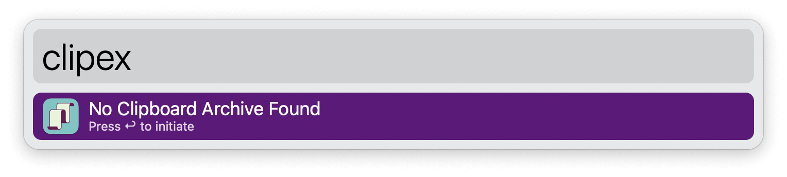
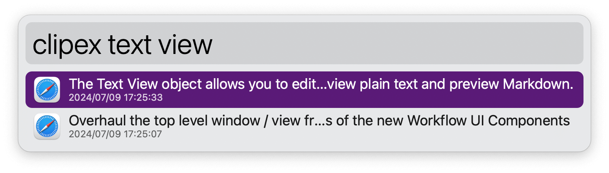
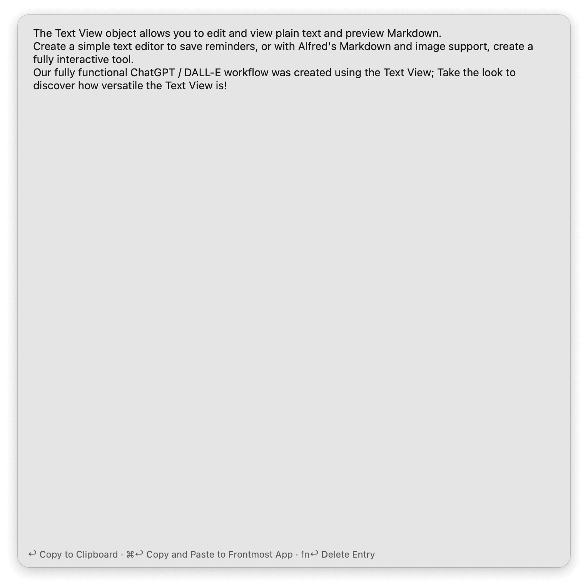

#  Clipboard History Extender Alfred Workflow

Backup and view Clipboard History text items

[⤓ Install on the Alfred Gallery](https://alfred.app/workflows/alfredapp/clipboard-history-extender)

## Setup

Create an ever-expanding copy of your [Clipboard History](https://www.alfredapp.com/help/features/clipboard/) via the `clipex` keyword. A macOS launchd agent will be loaded to update it daily.

## Usage

Search for archived Clipboard History text entries via the `clipex` keyword. Press <kbd>↩&#xFE0E;</kbd> to view the full text of an entry in a [Text View](https://www.alfredapp.com/help/workflows/user-interface/text/).

* <kbd>↩&#xFE0E;</kbd> Copy to clipboard.
* <kbd>⌘</kbd><kbd>↩&#xFE0E;</kbd> Copy and paste to frontmost app.
* <kbd>⇧</kbd><kbd>↩&#xFE0E;</kbd> Delete entry from the archive.
* <kbd>⌘</kbd><kbd>⌥</kbd><kbd>⌃</kbd><kbd>↩&#xFE0E;</kbd> Force archive update.
